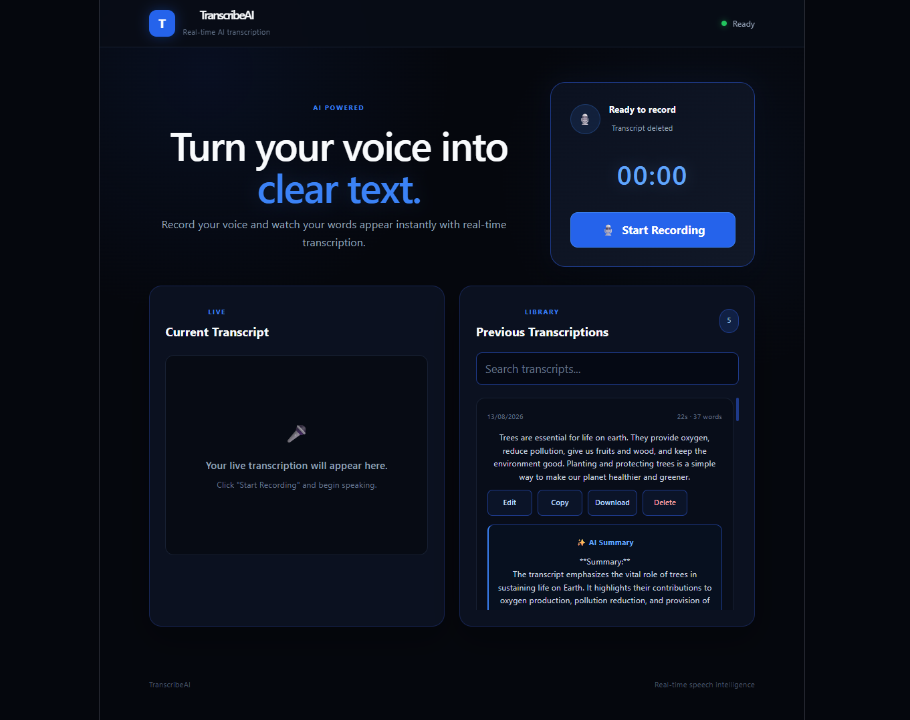
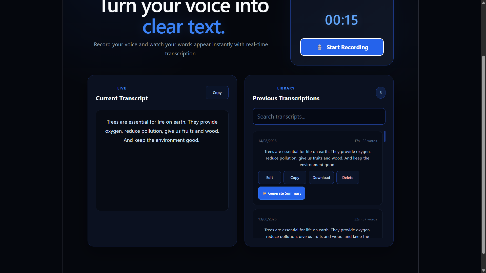
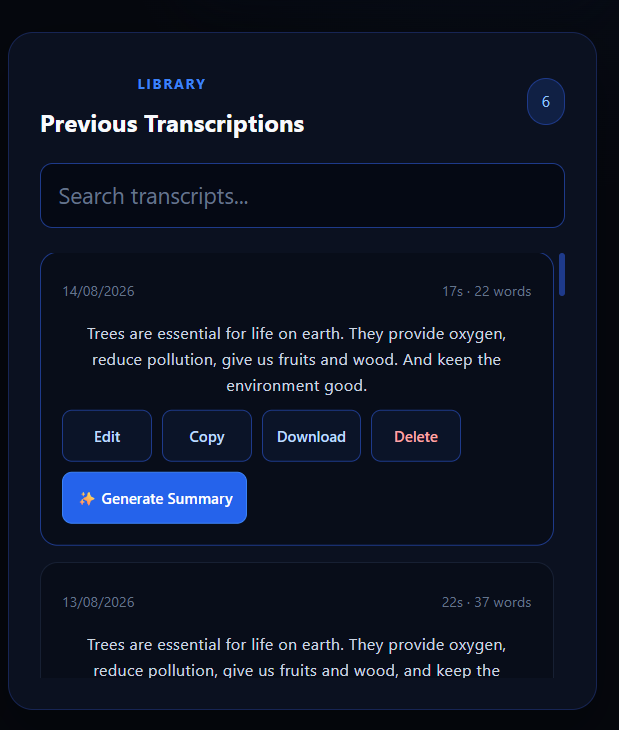
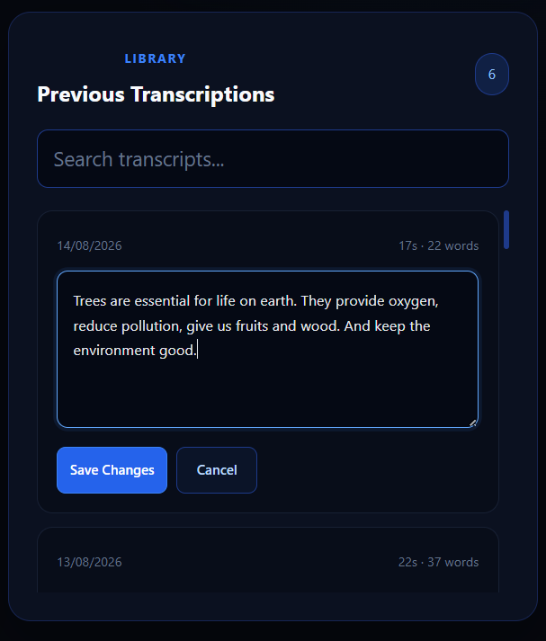
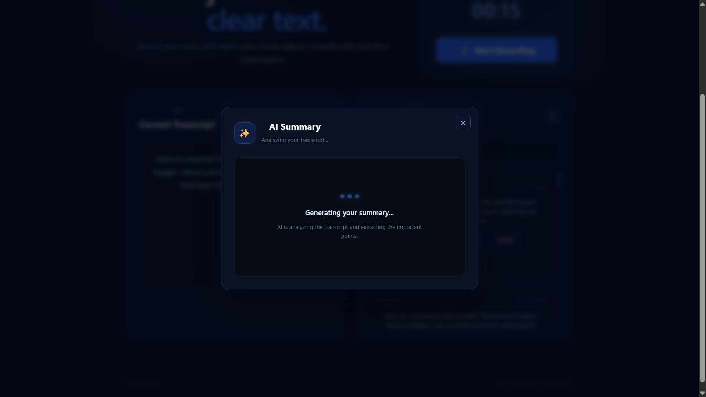
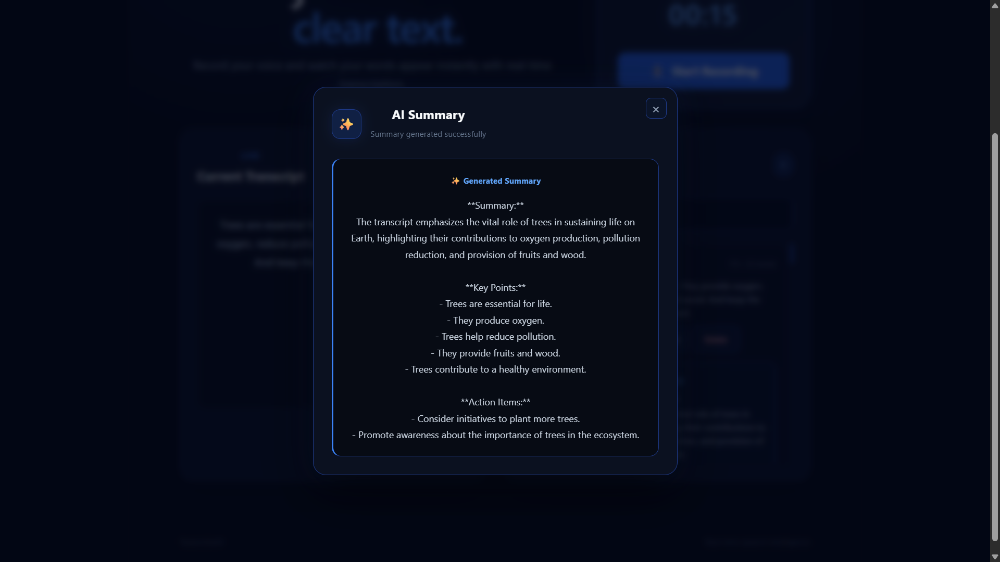

# TranscribeAI

TranscribeAI is a real-time AI-powered speech transcription web application that converts spoken audio into text using Deepgram's real-time speech recognition service. The application also stores transcripts in MongoDB and provides AI-generated summaries.

## Features

- Real-time speech-to-text transcription
- Start and stop voice recording
- Live transcription display
- Recording timer
- Transcript history
- Search previous transcripts
- Copy transcript to clipboard
- Download transcript as a TXT file
- Edit saved transcripts
- Delete transcripts
- AI-powered transcript summarization
- AI summary generation popup with loading state
- Connection status indication
- Responsive and modern dark/blue user interface
- Persistent transcript storage using MongoDB

## Tech Stack

### Frontend
- React
- Vite
- JavaScript
- CSS

### Backend
- Node.js
- Express.js
- WebSocket

### AI / Speech Services
- Deepgram for real-time speech transcription
- LLM API for transcript summarization

### Database
- MongoDB

## Architecture

The application follows a client-server architecture.

```text
User
 │
 ▼
React Frontend
 │
 │ WebSocket
 ▼
Node.js + Express Backend
 │
 ├──────────────► Deepgram
 │                  │
 │                  ▼
 │              Live Transcript
 │
 ├──────────────► MongoDB
 │                  │
 │                  ▼
 │             Transcript History
 │
 └──────────────► LLM API
                    │
                    ▼
                AI Summary
```

## How It Works

1. The user starts recording from the frontend.
2. The browser captures microphone audio using the MediaRecorder API.
3. Audio chunks are sent to the backend through a WebSocket connection.
4. The backend establishes a connection with Deepgram for real-time speech recognition.
5. Deepgram sends transcription results back to the backend.
6. The backend forwards the transcription results to the React frontend.
7. Final transcripts can be saved to MongoDB.
8. Saved transcripts are displayed in the transcript history.
9. Users can search, copy, download, edit, and delete saved transcripts.
10. Users can generate an AI summary for a saved transcript.
11. The LLM API processes the transcript and returns the generated summary.
12. The summary is displayed inside an AI generation popup.

## Project Structure

```text
TranscribeAI/
│
├── client/
│   ├── src/
│   │   ├── App.jsx
│   │   ├── App.css
│   │   └── ...
│   └── package.json
│
├── server/
│   ├── controllers/
│   ├── models/
│   ├── routes/
│   ├── services/
│   ├── server.js
│   └── package.json
│
├── .gitignore
└── README.md
```

## Setup Instructions

### 1. Clone the repository

```bash
git clone https://github.com/Prashant0108-np/TranscribeAI.git
cd TranscribeAI
```

### 2. Install frontend dependencies

```bash
cd client
npm install
```

### 3. Install backend dependencies

```bash
cd ../server
npm install
```

### 4. Configure environment variables

Create a `.env` file inside the `server` directory.

```env
PORT=5000
MONGODB_URI=your_mongodb_connection_string
DEEPGRAM_API_KEY=your_deepgram_api_key
LLM_API_KEY=your_llm_api_key
```

### 5. Start the backend

```bash
cd server
npm run dev
```

Backend:

```text
http://localhost:5000
```

### 6. Start the frontend

Open another terminal:

```bash
cd client
npm run dev
```

Frontend:

```text
http://localhost:5173
```

## Environment Variables

| Variable | Description |
|---|---|
| `PORT` | Port used by the backend server |
| `MONGODB_URI` | MongoDB database connection string |
| `DEEPGRAM_API_KEY` | API key used for Deepgram transcription |
| `LLM_API_KEY` | API key used for AI summarization |

## API Endpoints

### Transcript APIs

| Method | Endpoint | Description |
|---|---|---|
| POST | `/api/transcripts` | Save a transcript |
| GET | `/api/transcripts` | Fetch saved transcripts |
| PUT | `/api/transcripts/:id` | Update an existing transcript |
| DELETE | `/api/transcripts/:id` | Delete a transcript |

### WebSocket

```text
ws://localhost:5000/transcribe
```

The WebSocket connection is used to transfer audio data and receive real-time transcription results.

## AI Summary

TranscribeAI provides AI-powered summarization for saved transcripts.

When the user selects **Generate Summary**:

1. The frontend sends the transcript ID to the backend.
2. The backend processes the transcript using the configured LLM API.
3. The generated summary is returned to the application.
4. The summary is stored with the transcript.
5. The frontend displays the result in a dedicated AI Summary popup.
6. A loading state is displayed while the AI response is being generated.

## Database

MongoDB is used for persistent storage of transcripts.

Each transcript contains information such as:

- Transcript text
- Recording duration
- Word count
- AI-generated summary
- Creation timestamp

## Assumptions

- The application is used in a modern web browser with microphone support.
- The user grants microphone permission before recording.
- Required API keys are configured through environment variables.
- MongoDB is available using the configured connection string.
- Internet connectivity is required for Deepgram transcription and AI summarization.
- The application currently focuses on a single-user local workflow.

## Error Handling

The application handles common errors such as:

- Microphone permission errors
- WebSocket connection errors
- Transcription service errors
- Failed transcript saving
- Failed transcript updating
- Failed transcript deletion
- AI summary generation errors
- Database errors

Connection status is also displayed in the interface to provide feedback when the transcription connection is unavailable.

## Security

Sensitive credentials are stored in environment variables and are excluded from version control.

The following files and directories should not be committed:

```text
.env
.env.local
node_modules/
dist/
```

## Future Enhancements

The following features can be considered for future versions:

- Improved speaker diarization
- Automatic WebSocket reconnection
- User authentication and individual transcript accounts
- PDF and DOCX transcript export
- Audio recording playback
- Multi-language transcription
- Advanced transcript formatting
- Better handling of long recording sessions
- Cloud deployment and scalable infrastructure

## Testing

The application was tested for the following workflows:

- Starting and stopping recordings
- Real-time transcription
- Saving transcripts
- Fetching transcript history
- Searching transcripts
- Copying transcripts
- Downloading transcripts
- Editing transcripts
- Deleting transcripts
- Generating AI summaries
- Displaying AI summary loading state
- Handling connection status

## Linting

The frontend uses ESLint for code quality checks.

Run:

```bash
cd client
npm run lint
```

The project should complete linting without errors.

## Screenshots

### Main Dashboard



### Real-Time Transcription



### Transcript History



### Edit Transcript



### AI Summary




## Author

**Prashant Kumar**
